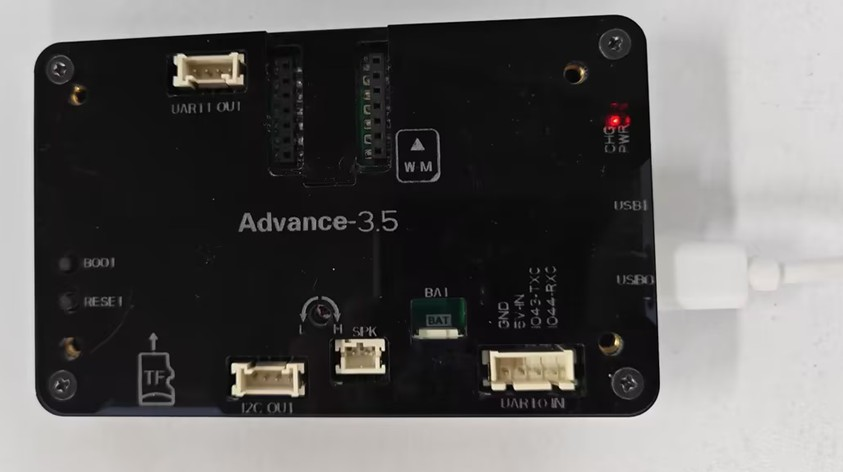
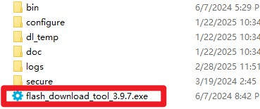
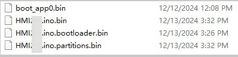
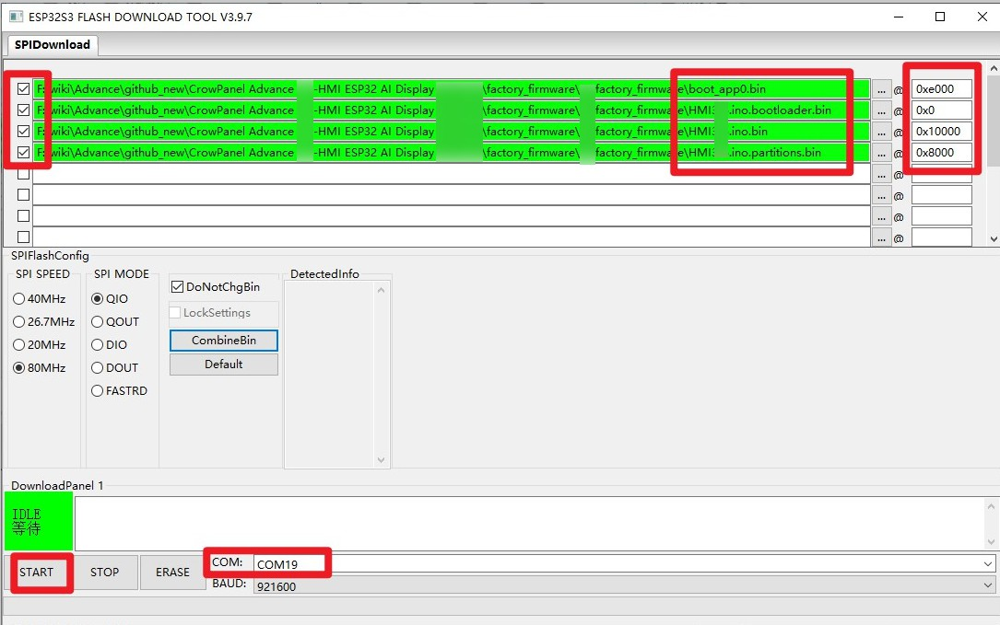
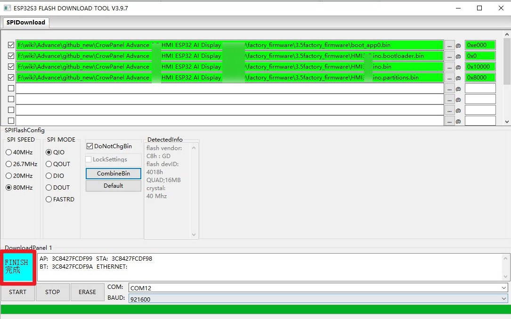
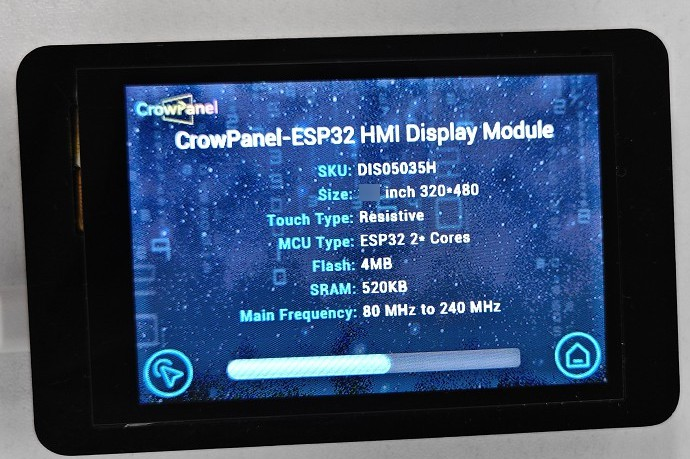

<<<<<<< HEAD
# How to install the factory demo firmware with flash download tool?

#### 1.Preparation:

- USB C cable
- Laptop/PC
- Crowpanel Advance HMI ESP32 AI Display
- Flash download tool

Check whether the materials on the PCBA board are defective. Such as less material, false welding, tin and other bad phenomena.

#### 2.Flash the firmware 

##### Step1 Connect the ESP32 display to the laptop/PC with USB-C cable. The power indicator will light up.

##### Step2 Open the flash download tool. 

For the  Crowpanel Advance HMI ESP32 AI Display, the chip select ESP32-S3:

##### Step3

①Choose the firmware files;

②Enter the address: 

boot_app0.bin------0xe000

xxxx.ino.bin--------0x10000

xxxx.ino.bootloader.bin------0x0

xxxx.ino.partitions.bin-------0x8000

③Check the firmware files;

④Select the correct port number;

⑤Click “Start” to download

##### Step5 After the download is complete, blue FINISH will be displayed, and the progress bar at the bottom shows that it has come to an end.

##### Step6 Press the reset button to show the demo.

=======
# How to install the factory demo firmware with flash download tool?

#### 1.Preparation:

- USB C cable
- Laptop/PC
- Crowpanel Advance HMI ESP32 AI Display
- Flash download tool

Check whether the materials on the PCBA board are defective. Such as less material, false welding, tin and other bad phenomena.

#### 2.Flash the firmware 

##### Step1 Connect the ESP32 display to the laptop/PC with USB-C cable. The power indicator will light up.

##### Step2 Open the flash download tool. 

For the  Crowpanel Advance HMI ESP32 AI Display, the chip select ESP32-S3:

##### Step3

①Choose the firmware files;

②Enter the address: 

boot_app0.bin------0xe000

xxxx.ino.bin--------0x10000

xxxx.ino.bootloader.bin------0x0

xxxx.ino.partitions.bin-------0x8000

③Check the firmware files;

④Select the correct port number;

⑤Click “Start” to download

##### Step5 After the download is complete, blue FINISH will be displayed, and the progress bar at the bottom shows that it has come to an end.

##### Step6 Press the reset button to show the demo.

>>>>>>> 2c4582b (new)
